# 音频真伪检测系统
基于 Flask + TensorFlow 构建的端到端音频真伪检测系统，支持 LSTM/Transformer 双模型训练与推理，覆盖「数据预处理→特征提取→模型训练→可视化分析→批量预测」全流程，可高效识别真实音频与AI生成伪造音频。

## 📚 目录
- [功能特性](#-功能特性)
- [环境要求](#-环境要求)
- [数据集格式要求](#-数据集格式要求)
- [快速开始](#-快速开始)
- [核心模块说明](#-核心模块说明)
- [Web界面使用](#-web界面使用)
- [常见问题](#-常见问题)
- [联系我们](#-联系我们)

## 🌟 功能特性
| 模块         | 核心能力                                                                 |
|--------------|--------------------------------------------------------------------------|
| 数据预处理   | 支持 wav/mp3/flac/m4a/webm 多格式音频；自动标准化采样率/时长；生成结构化NPZ数据 |
| 特征提取     | 提取音频核心声学特征：ZCR（过零率）、RMS（均方根能量）、MFCC（梅尔频率倒谱系数） |
| 模型训练     | 支持 LSTM/Transformer 两种深度学习模型；自定义批次大小、训练轮数、学习率等参数 |
| 可视化分析   | 生成音频波形图、特征热力图（MFCC/差分MFCC）、ZCR/RMS时域曲线；支持结果可视化展示 |
| 预测功能     | 单文件预测/文件夹批量预测；实时展示预测进度、置信度及结果分类               |
| Web可视化界面| 无代码操作全流程；支持任务进度监控、结果一键导出、可视化图表查看             |

## 📋 环境要求
### 基础环境
- Python 3.8 ~ 3.10（推荐3.9，兼容TensorFlow 2.x，避免3.11+的兼容性问题）
- 操作系统：Windows 10+/Linux (Ubuntu 18.04+)/macOS 12+
- 硬件：CPU/GPU均可（GPU需配置CUDA 11.2+、cuDNN 8.1+，加速模型训练）

### 依赖工具（必装）
#### 1. FFmpeg（处理非WAV格式音频）
- Windows：下载 [FFmpeg](https://ffmpeg.org/download.html)，解压后将`bin`目录添加到系统环境变量
- Linux：`sudo apt update && sudo apt install ffmpeg`
- macOS：`brew install ffmpeg`

#### 2. Python依赖安装
```bash
# 克隆项目
git clone https://github.com/BuHuiNieLanKing/AudioForgeryDetection.git
cd AudioForgeryDetection

# 安装核心依赖
pip install -r requirements.txt

# 安装dlib（Windows预编译包，Linux/macOS可直接pip install dlib）
cd dlib
# 适配Python3.8的预编译包，其他版本需下载对应whl文件
pip install dlib-19.19.0-cp38-cp38-win_amd64.whl
cd ..  # 回到项目根目录
```

## 📊 数据集格式要求
### 1. 核心目录结构
数据集需按「根目录 → 分类子目录」的层级组织，**fake** 目录存放伪造音频，**real** 目录存放真实音频，示例如下：
```
F:\archive\small_dataset\small_dataset\training  # 数据集根目录（可命名为train/val/testing...）
├── fake/                                       # 伪造音频目录（标签0）
│   ├── fake_audio_1.wav
│   ├── fake_audio_2.mp3
│   └── ...（支持wav/mp3/flac/m4a/webm格式）
└── real/                                       # 真实音频目录（标签1）
    ├── real_audio_1.wav
    ├── real_audio_2.mp3
    └── ...（支持wav/mp3/flac/m4a/webm格式）
```

### 2. 格式规范
- 目录命名：必须为 `fake`（伪造）和 `real`（真实），区分大小写（建议全小写）；
- 音频格式：支持 wav/mp3/flac/m4a/webm，预处理阶段会自动统一格式；
- 路径要求：数据集根目录路径建议为绝对路径（如 `F:\archive\small_dataset\small_dataset\`），避免中文/空格特殊字符；
- 数据集划分：建议按 7:2:1 划分训练集（train）、验证集（val）、测试集（testing），各子集均遵循上述目录结构。

### 3. 适配修改
在 `preprocess_data.py` 中修改数据集根目录路径，示例：
```python
# 原路径
dataset_path = "./data/raw_audio"
# 修改为你的数据集根目录
dataset_path = r"F:\archive\small_dataset\small_dataset\testing"
```

## 🚀 快速开始
### 前置准备
1. 确认数据集已按上述格式存放，且路径无中文/空格；
2. 修改各脚本中的**路径配置**（关键！）：
   - 所有脚本中 `feature_dir`/`audio_dir`/`save_dir` 等路径，替换为你本地路径（如 `F:/AudioForgeryDetection/data/raw_audio`）；
   - 示例：`feature_dir = './static/features'` → `feature_dir = 'F:/AudioForgeryDetection/static/features'`。

### 分步执行（命令行）
#### 1. 数据预处理
```bash
# 标准化音频格式，生成预处理后的NPZ文件
python preprocess_data.py
```
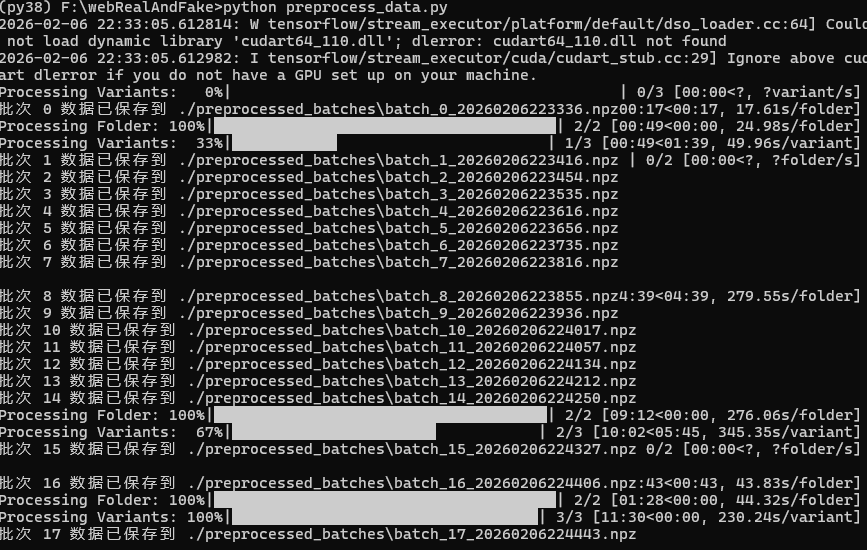
- 输出：预处理后的音频数据保存至 `./preprocessed_batches` 目录

#### 2. 特征提取
```bash
# 提取ZCR/RMS/MFCC特征，保存为特征矩阵
python features.py
```
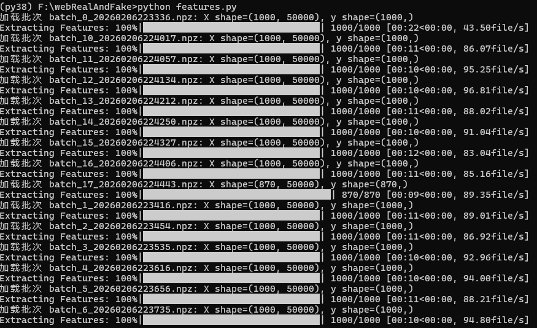
- 输出：特征文件保存至 `./features_batches` 目录（.npz格式，含X_features特征矩阵、y标签）

#### 3. 可视化分析
```bash
# 可视化预处理后的音频波形
python showPreProcessed.py

# 可视化特征分布（MFCC热力图、ZCR/RMS曲线、MFCC差分图）
python showFeatures.py
```
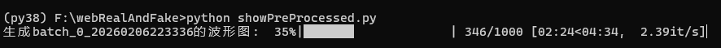
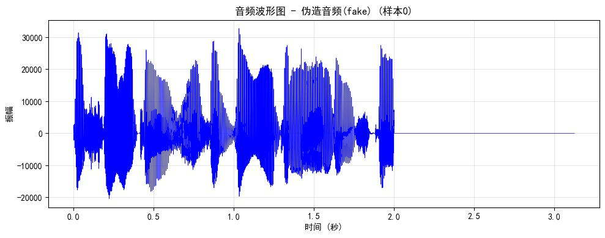

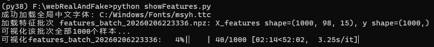

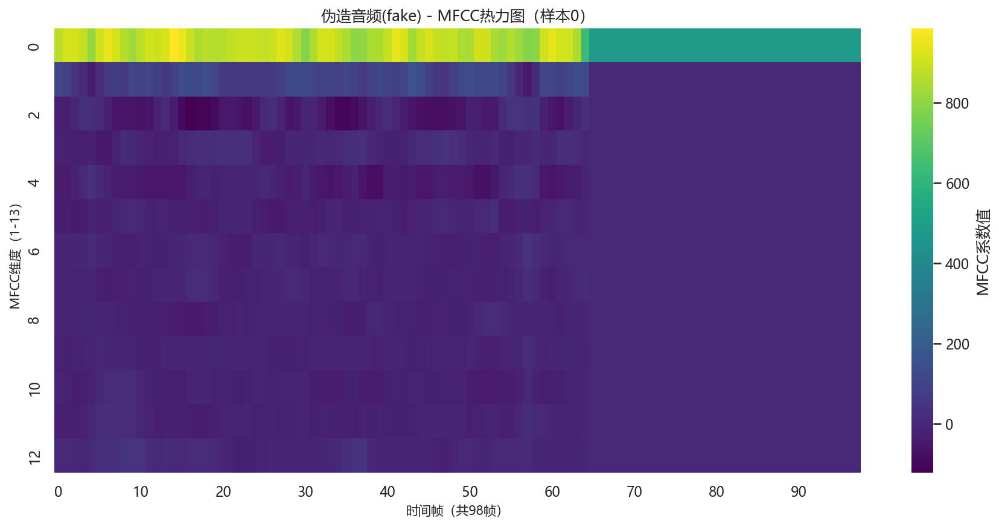

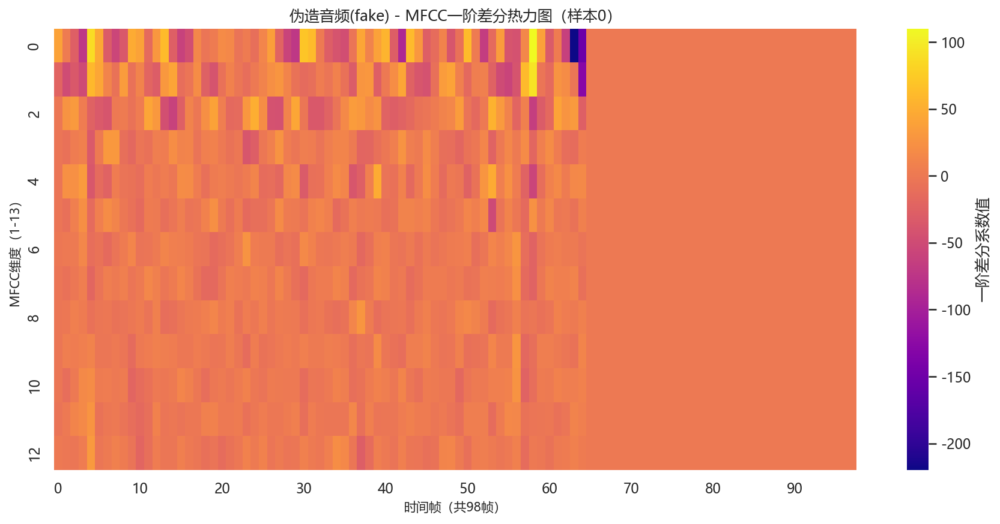

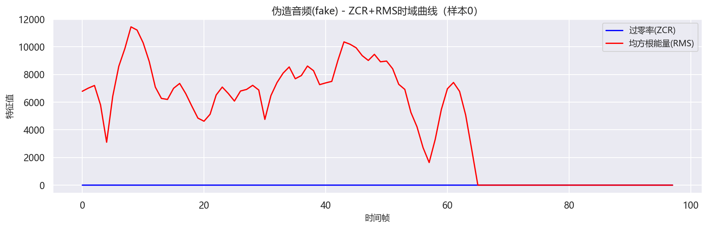
- 输出：可视化图片保存至 `./audio_waveform_images,./feature_visualizations` 目录，按「real/fake」分类存储

#### 4. 模型训练
```bash
# 训练LSTM模型
python trainLstm.py
# 训练Transformer模型
python trainTransformer.py
```
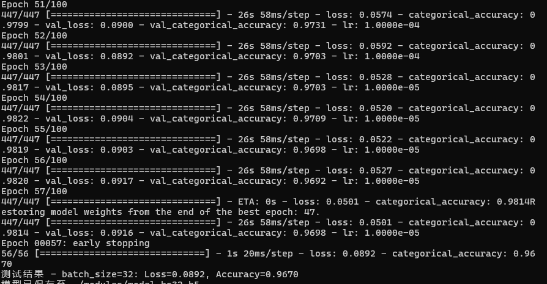

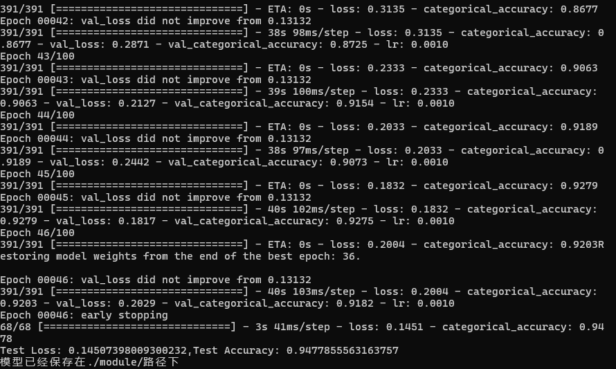
- 输出：训练好的模型保存至 `models` 目录（.h5格式）

#### 5. 批量预测
```bash
# 对目标文件夹内的音频进行真伪检测
python predict.py
```

lstm 模型预测结果
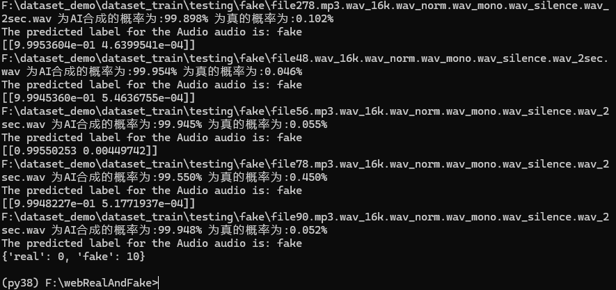
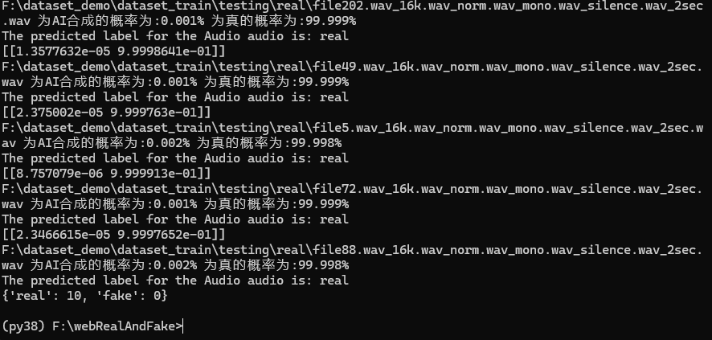

Transformer 模型预测结果
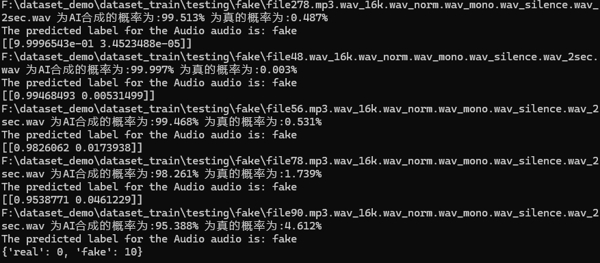
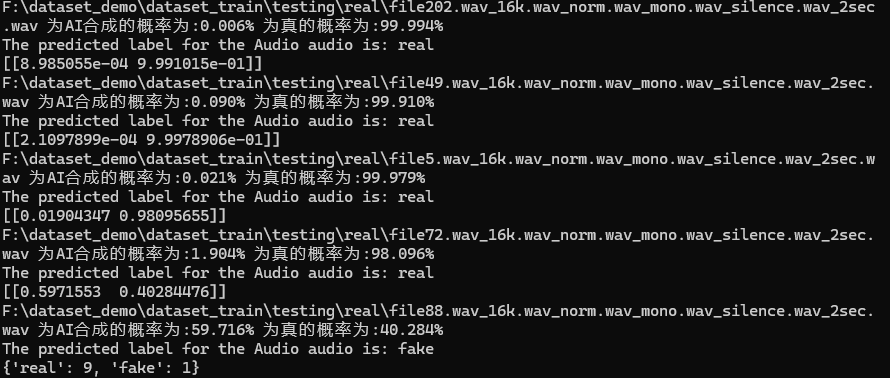

- 输入：需预测的音频文件夹路径（在predict.py中配置）；
- 输出：含文件名、预测标签、置信度。

## 🖥️ Web界面使用
### 启动Web服务
```bash
# 运行Flask Web应用
python app.py
```
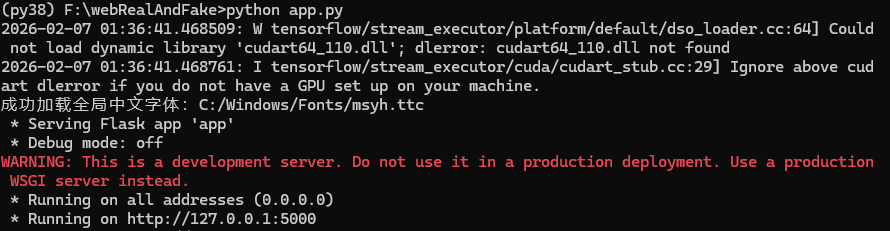

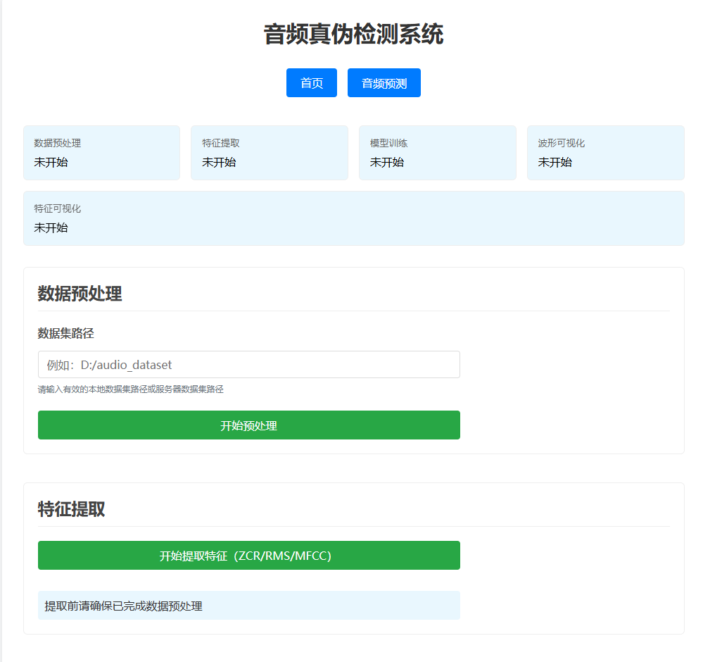
### 操作流程
1. 浏览器访问 `http://localhost:5000`（默认端口）；
2. 左侧导航栏依次执行：
   - 「数据上传」：上传待处理的音频文件；
   - 「数据预处理」：点击开始按钮，等待预处理完成；
   - 「特征提取」：自动提取声学特征；
   - 「模型训练」：选择LSTM/Transformer，配置参数后开始训练；
   - 「可视化分析」：查看特征热力图、波形图等；
   - 「预测」：上传音频文件，实时查看预测结果。

## 📖 核心模块说明
| 脚本文件          | 核心作用                                                                 |
|-------------------|--------------------------------------------------------------------------|
| preprocess_data.py| 音频格式标准化、时长裁剪、采样率统一，生成模型可读取的NPZ数据             |
| features.py       | 提取ZCR/RMS/MFCC特征，拼接为15维特征矩阵，按批次保存为.npz文件           |
| showPreProcessed.py| 可视化预处理后的音频波形，直观查看音频时域特征                           |
| showFeatures.py   | 可视化声学特征：MFCC热力图、ZCR/RMS时域曲线、MFCC一阶/二阶差分图         |
| trainLstm.py      | 基于LSTM网络训练音频真伪分类模型，适合序列特征建模                       |
| trainTransformer.py| 基于Transformer的自注意力机制训练模型，捕捉长距离特征依赖               |
| predict.py        | 加载训练好的模型，支持单文件/批量音频预测，输出分类结果和置信度           |
| app.py            | Flask Web服务入口，封装所有功能为可视化界面                             |


## 📞 联系我们
- QQ：310720949
- 问题反馈：可在GitHub项目下提交Issue，或通过QQ反馈使用过程中的问题

## 📄 许可证
本项目仅供学习和研究使用，禁止用于商业用途。